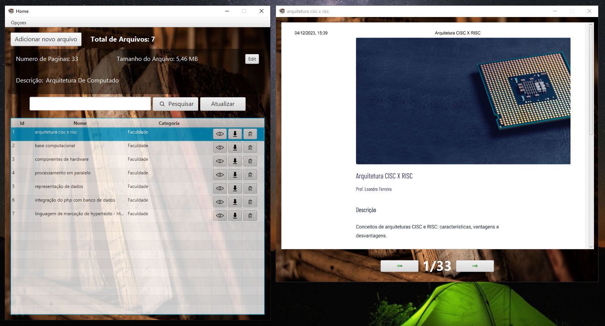

# 🗂️ File-organizer

Aplicação desktop em JavaFX para gerenciamento de arquivos PDF, permitindo cadastrar, listar, atualizar e remover documentos em uma biblioteca local.

---

## 🚀 Funcionalidades (Implementadas)

- Cadastro e listagem de arquivos PDF

- Atualização e remoção de registros

- Armazenamento local com banco de dados SQLite

- Manipulação de PDFs (extração e leitura via PDFBox)

---

## 🛠️ Tecnologias Utilizadas

- java 21

- javaFX

- logback: Ferramenta de registro (logging) em Java, utilizada para gerar logs de maneira flexível e eficiente.

- slf4j: (Simple Logging Facade for Java) é uma API de abstração de logging para a linguagem Java, permitindo que você utilize diferentes frameworks de logging de forma intercambiável.

- sqlite-jdbc: Driver JDBC (Java Database Connectivity) que permite que aplicativos Java se conectem a bancos de dados SQLite.

- apache PDFBox: Biblioteca Java que permite a manipulação de arquivos PDF, incluindo a criação, edição, extração de conteúdo e assinatura digital de documentos PDF.

---

## 🗄️ Banco de Dados Utilizado

SQLite — Sistema de gerenciamento de banco de dados relacional leve, embutido e autossuficiente, ideal para aplicações locais sem necessidade de servidor externo.

---

## ⚙️ Como Executar o Projeto

- Crie um novo projeto Java na sua IDE preferida

- Substitua a pasta src pela deste repositório

- Adicione as bibliotecas necessárias ao classpath: logback, slf4j, sqlite-jdbc, apache PDFBox

- Compile e execute o projeto

- Caso utilize outro banco de dados, modifique a classe DB conforme necessário

